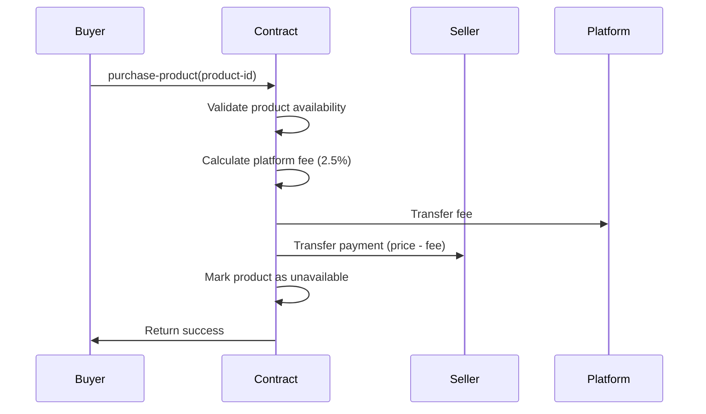
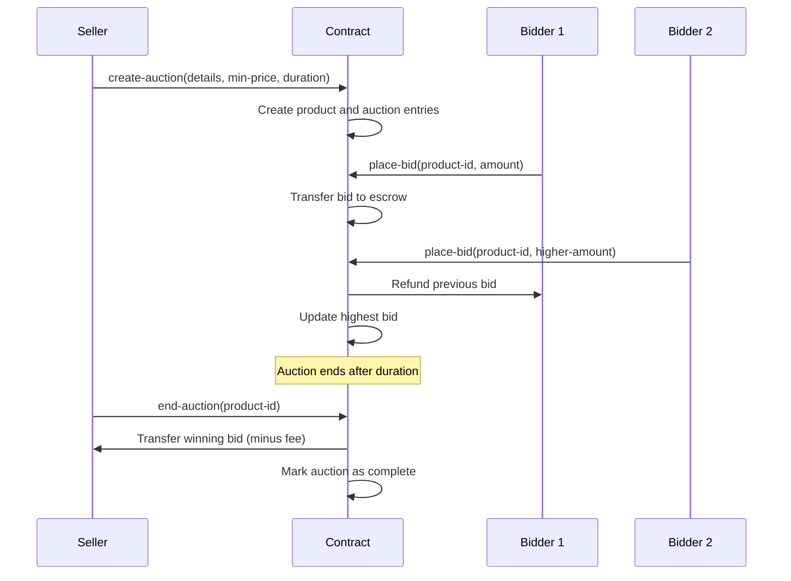

# TrustGrid - Next-Generation Decentralized Commerce Platform


## Overview

TrustGrid is a revolutionary peer-to-peer commerce ecosystem that eliminates traditional e-commerce intermediaries by leveraging Bitcoin's security and Stacks' smart contract capabilities. The platform creates a truly trustless marketplace experience where merchants and consumers can transact directly without relying on centralized platforms.

## Key Features

- **🏪 Brand Registry**: Merchant verification and brand management system
- **📦 Product Catalog**: Comprehensive product listings with dynamic pricing
- **⚡ Instant Purchases**: Direct peer-to-peer transactions with escrow
- **🏆 Auction System**: Time-bound competitive bidding mechanism
- **⭐ Reputation System**: Customer reviews and rating infrastructure
- **💰 Transparent Fees**: 2.5% platform fee with full transparency
- **🔒 Trustless Escrow**: Automated fund management and dispute resolution

## System Architecture

### Contract Architecture

```
TrustGrid Smart Contract
├── Brand Management
│   ├── Brand Registration
│   └── Verification System
├── Product Management
│   ├── Product Listings
│   └── Availability Tracking
├── Commerce Engine
│   ├── Instant Purchases
│   └── Auction System
└── Reputation System
    ├── Reviews
    └── Rating System
```

### Core Components

#### 1. Brand Registry

- **Purpose**: Manages merchant identities and verification status
- **Features**: Registration, verification, brand profiles
- **Data Structure**: Principal-based mapping with verification flags

#### 2. Product Catalog

- **Purpose**: Comprehensive product listing management
- **Features**: Dynamic pricing, availability tracking, auction integration
- **Data Structure**: Sequential product IDs with rich metadata

#### 3. Auction Mechanism

- **Purpose**: Time-bound competitive bidding system
- **Features**: Minimum price enforcement, automatic bid management, winner selection
- **Data Structure**: Block-height based timing with bid tracking

#### 4. Reputation System

- **Purpose**: Trust building through customer feedback
- **Features**: 5-star rating system, written reviews, timestamp tracking
- **Data Structure**: Composite key mapping (product + reviewer)

## Data Flow

### Purchase Flow



### Auction Flow



## Smart Contract Interface

### Brand Management

```clarity
;; Register as a merchant
(define-public (register-brand (name (string-ascii 50))))

;; Verify brand (platform owner only)
(define-public (verify-brand (brand principal)))
```

### Product Management

```clarity
;; List a new product
(define-public (list-product 
  (name (string-ascii 100))
  (description (string-ascii 500))
  (price uint)))

;; Purchase a product instantly
(define-public (purchase-product (product-id uint)))
```

### Auction System

```clarity
;; Create an auction
(define-public (create-auction
  (name (string-ascii 100))
  (description (string-ascii 500))
  (min-price uint)
  (duration uint)))

;; Place a bid
(define-public (place-bid 
  (product-id uint)
  (bid-amount uint)))

;; End auction and process payment
(define-public (end-auction (product-id uint)))
```

### Reputation System

```clarity
;; Add a product review
(define-public (add-review
  (product-id uint)
  (rating uint)
  (comment (string-ascii 200))))
```

### Read-Only Functions

```clarity
;; Get product details
(define-read-only (get-product (product-id uint)))

;; Get brand information
(define-read-only (get-brand (brand principal)))

;; Get review details
(define-read-only (get-review (product-id uint) (reviewer principal)))

;; Get auction information
(define-read-only (get-auction (product-id uint)))
```

## Error Codes

| Code | Error | Description |
|------|-------|-------------|
| 100 | `err-owner-only` | Action restricted to contract owner |
| 101 | `err-not-brand-owner` | Brand not registered or unauthorized |
| 102 | `err-invalid-price` | Price must be greater than zero |
| 103 | `err-listing-not-found` | Product does not exist |
| 104 | `err-insufficient-funds` | Insufficient STX balance |
| 105 | `err-auction-ended` | Auction has already ended |
| 106 | `err-bid-too-low` | Bid below minimum or current highest |
| 107 | `err-no-active-auction` | No active auction found |
| 108 | `err-invalid-duration` | Auction duration too short (min 10 blocks) |
| 109 | `err-invalid-rating` | Rating must be between 1-5 |

## Fee Structure

- **Platform Fee**: 2.5% of transaction value
- **Fee Distribution**: Automatically deducted and transferred to platform
- **Transparency**: All fees calculated and processed on-chain

## Getting Started

### Prerequisites

- [Clarinet](https://github.com/hirosystems/clarinet) for contract development
- [Stacks Wallet](https://www.hiro.so/wallet) for interaction
- Basic understanding of Clarity smart contracts

### Installation

1. Clone the repository:

```bash
git clone https://github.com/adeola-martins/trust-grid.git
cd trust-grid
```

2. Install dependencies:

```bash
npm install
```

3. Check contract syntax:

```bash
clarinet check
```

4. Run tests:

```bash
npm test
```

### Deployment

1. Configure your deployment settings in `settings/`
2. Deploy to testnet:

```bash
clarinet deploy --testnet
```

## Testing

The project includes comprehensive test coverage for all contract functions:

```bash
# Run all tests
npm test

# Check contract syntax
clarinet check

# Run specific test file
npm run test:unit
```

## Security Considerations

- **Escrow Management**: All funds are held in contract escrow during transactions
- **Access Control**: Brand-specific operations are restricted to registered merchants
- **Auction Integrity**: Time-based validation prevents manipulation
- **Fee Transparency**: All calculations performed on-chain with full visibility

## Roadmap

- [ ] Multi-token support (SIP-010 tokens)
- [ ] Dispute resolution mechanism
- [ ] Advanced reputation algorithms
- [ ] Cross-chain bridge integration
- [ ] Mobile SDK development
- [ ] Merchant dashboard

## Contributing

We welcome contributions! Please see our [Contributing Guidelines](CONTRIBUTING.md) for details.

1. Fork the repository
2. Create a feature branch
3. Commit your changes
4. Push to the branch
5. Create a Pull Request

## License

This project is licensed under the MIT License - see the [LICENSE](LICENSE) file for details.

## Acknowledgments

- Built on [Stacks](https://stacks.co) blockchain
- Powered by [Clarity](https://clarity-lang.org) smart contracts
- Secured by [Bitcoin](https://bitcoin.org) network

---

**TrustGrid** - Empowering decentralized commerce, one transaction at a time.
